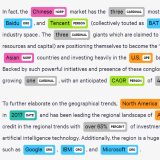

# Federated Learning in Azure ML

Federated Learning (FL) is a framework where one trains a single ML model on distinct datasets that cannot be gathered in a single central location. This enables companies and institutions to comply with regulations related to data location and data access while allowing for innovation and personalization.

This repo provides some code samples for running a federated learning pipeline in the Azure Machine Learning platform.

:warning: Running a full federated learning pipeline raises **security questions that you need to address** before using this repository for production purpose. Please consider this repository as a sample only.

## Table of contents

- [:zap: Getting Started](#zap-getting-started)
- [Real world examples](#real-world-examples)
- [FL Frameworks](#fl-frameworks)
- [Documentation](#documentation)
- [Need Support?](#need-support)
- [Contributing](#contributing)

### :zap: Getting Started

No time to read? Go directly to the [**quickstart**](./docs/quickstart.md) to provision a demo within minutes in your own subscription.

To understand the journey to achieve production-ready Federated Learning, please check our guide to [**Plan Your FL Project**](./docs/concepts/plan-your-fl-project.md).

To know more about the resource provisioning alternatives, please go to the provisioning [**cookbook**](./docs/provisioning/README.md).

### :star: Success stories

Here are some links showing applications of FL on Azure ML in production:

- [Microsoft Health & Life Sciences, Text Analytics for Health](https://customers.microsoft.com/en-us/story/1587521717158304168-microsoft-partner-professional-services-azure)

### Real world examples

Please also check our industry use cases below.

| Medical Imaging | Named Entity Recognition | Fraud Detection |
| :-: | :-: | :-: |
|  |  |  |
| [pneumonia.md](./docs/real-world-examples/pneumonia.md) | [ner.md](./docs/real-world-examples/ner.md) | [ccfraud.md](./docs/real-world-examples/ccfraud.md) |

### FL Frameworks

If you are already using a specific FL framework, you can port your code to work with AzureML. The following table shows the tested frameworks and the corresponding code samples.

| Framework | Status |
| :-- | :-- |
| [**NVFlare**](./docs/frameworks/nvflare.md) | Experimental, works only with in-cloud FL. |
| [**Flower**](./docs/frameworks/flower.md) | Experimental, works only with in-cloud FL. |

### Documentation

Please find a full documentation of this project [**here**](docs/README.md).

### Need Support?

Please check the [**troubleshooting guide**](./docs/troubleshoot.md) for possible solutions. If you are unable to find a solution, please open an issue in this repository.

If you have any feature requests, technical questions, or find any bugs, please do not hesitate to reach out to us.

For bug reports and feature requests, you are welcome to open an [**issue**](https://github.com/Azure-Samples/azure-ml-federated-learning/issues).

### Contributing

This project welcomes contributions and suggestions. Most contributions require you to agree to a Contributor License Agreement (CLA) declaring that you have the right to, and actually do, grant us the rights to use your contribution. For details, visit <https://cla.opensource.microsoft.com>.

To contribute, please start by creating a self-assigned [**issue**](https://github.com/Azure-Samples/azure-ml-federated-learning/issues/new) giving a high-level overview of what you'd like to do. Once any discussion there concludes, follow up with a PR.

Please send an email to aims-team@microsoft.com to request a "contributor" access to this repository, if you have difficulty in creating a branch. When you submit a pull request, a CLA bot will automatically determine whether you need to provide a CLA and decorate the PR appropriately (e.g., status check, comment). Simply follow the instructions provided by the bot. You will only need to do this once across all repos using our CLA.

This project has adopted the Microsoft Open Source Code of Conduct. For more information see the Code of Conduct FAQ or contact opencode@microsoft.com with any additional questions or comments.
