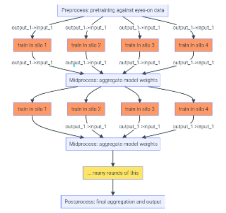

# Federated Learning in Azure ML

:warning: Running a full federated learning pipeline raises **security questions that you need to address** before using this repository for production purposes. Please consider this repository as a sample only.

## Table of contents

- [Federated Learning in Azure ML](#federated-learning-in-azure-ml)
  - [Table of contents](#table-of-contents)
  - [Motivation](#motivation)
- [Getting Started](#getting-started)
  - [Quickstart](#quickstart)
  - [Real-world examples](#real-world-examples)
    - [Pneumonia detection from chest radiographs](#pneumonia-detection-from-chest-radiographs)
    - [Named Entity Recognition using MultiNERD dataset](#named-entity-recognition-using-multinerd-dataset)
    - [Credit card fraud detection using synthetic transactional data](#credit-card-fraud-detection-using-synthetic-transactional-data)
  - [FL Frameworks](#fl-frameworks)
- [Concepts](#concepts)
  - [Why should you consider Federated Learning?](#why-should-you-consider-federated-learning)
  - [How to plan for your Federated Learning project](#how-to-plan-for-your-federated-learning-project)
  - [Vertical federated learning](#vertical-federated-learning)
  - [Integrate and secure FL experiments with MLOps](#integrate-and-secure-fl-experiments-with-mlops)
  - [Glossary](#glossary)
- [Tutorials](#tutorials)
  - [What this repo has to offer?](#what-this-repo-has-to-offer)
  - [Provisioning guide](#provisioning-guide)
  - [How to adapt the "literal" and the "scatter-gather" code for your own scenario](#how-to-adapt-the-literal-and-the-scatter-gather-code-for-your-own-scenario)
  - [Read local data in an on-premises Kubernetes silo](#read-local-data-in-an-on-premises-kubernetes-silo)
  - [Differential privacy for cross-silo horizontal federated learning](#differential-privacy-for-cross-silo-horizontal-federated-learning)
  - [Upload local data to silo storage account](#upload-local-data-to-silo-storage-account)
- [Troubleshooting guide](#troubleshooting-guide)

## Motivation

Local privacy regulations impose constraints on the movement of data out of a given region, or out of government agencies. Also, institutions or companies working together to leverage their respective data might require or desire to limit circulation of this data, and impose trust boundaries.

In those contexts, the data cannot be gathered in a central location, as is usual practice for training Machine Learning (ML) models. A technique called Federated Learning (FL) allows for training models in this highly constrained environment. It enables companies and institutions to comply with regulations related to data location and data access while allowing for innovation and achieving better quality models.

# Getting Started

## Quickstart

No time to read? Get directly to the [**quickstart**](./quickstart.md) to provision a demo within minutes in your own subscription.

To understand the journey to achieve production-ready Federated Learning, please check our guide to [**Plan Your FL Project**](./concepts/plan-your-fl-project.md).

To know more about the resource provisioning alternatives, please go to the provisioning [**cookbook**](./provisioning/README.md).

## Real-world examples

In addition to the [literal](../examples/pipelines/fl_cross_silo_literal/) and [scatter-gather](../examples/pipelines/fl_cross_silo_scatter_gather/) sample experiments, we also provide examples based on real-world applications.

> Note: The `upload-data` scripts are only included in the examples for the convenience of executing the FL examples. Please ignore this section if you are performing an actual FL experiment for your scenario.

|  |  |  |
| :-: | :-: | :-: |
| **Medical Imaging - Horizontal** | **Named Entity Recognition - Horizontal** | **Fraud Detection - Horizontal** |
|  |  |  |
| [pneumonia.md](./real-world-examples/pneumonia-horizontal.md) | [ner.md](./real-world-examples/ner-horizontal.md) | [ccfraud.md](./real-world-examples/ccfraud-horizontal.md) |
| **Fraud Detection - Vertical** | **Fraud Detection - Vertical with Single Shot Communication**  | **Bank Marketing - Vertical** |
|  |  |  |
| [ccfraud-vertical.md](./real-world-examples/ccfraud-vertical.md) | [ccfraud-vetical-fedonce.md](./real-world-examples/ccfraud-vetical-fedonce.md) | [bank-marketing-vertical.md](./real-world-examples/bank-marketing-vertical.md) |

### Pneumonia detection from chest radiographs

In this example, we train a model to detect pneumonia from chest radiographs. The model is trained on the [Chest X-ray dataset](https://www.kaggle.com/datasets/paultimothymooney/chest-xray-pneumonia)from Kaggle. This example is adapted from [that solution](https://github.com/Azure/medical-imaging/tree/main/federated-learning) by Harmke Alkemade _et al._ See [here](./real-world-examples/pneumonia-horizontal.md) for detailed instructions on how to run this example.

### Named Entity Recognition using MultiNERD dataset

This example shows how to train a federated model for the Named Entity Recognition task. This tutorial uses the [MultiNERD](https://github.com/Babelscape/multinerd/blob/master/README.md) dataset. See [here](./real-world-examples/ner-horizontal.md) for detailed instructions on how to run this example.

### Credit card fraud detection using synthetic transactional data

This example shows how to train a federated model for credit card fraud detection using synthetically generated dataset [Credit Card Transactions Fraud Detection Dataset](https://www.kaggle.com/datasets/kartik2112/fraud-detection). The techniques used include **Dense DNN**, **LSTM**, **LSTM based VAE**. See [here](./real-world-examples/ccfraud-horizontal.md) for detailed instructions on how to run this example.

## FL Frameworks

If you are already using a specific FL framework, you can port your code to work with AzureML. The following table shows the tested frameworks and the corresponding code samples.

| Framework | Status |
| :-- | :-- |
| [**Flower**](./frameworks/flower.md) | Experimental, works only with in-cloud FL. |
| [**NVFlare**](./frameworks/nvflare.md) | Experimental, works only with in-cloud FL. |

# Concepts

## Why should you consider Federated Learning?

Let's take the example of a data scientist working in a hospital to classify medical images to detect a specific patient condition. The team at the hospital _already_ has a deep learning model trained in a centralized fashion with their own patient data. The model achieved reasonable performance. Now the hospital wants to further improve the model's performance by partnering with other hospitals. Federated Learning will enable them to collaborate on the model training while keeping control of the hospital's own data, complying with their local regulations and privacy obligations, while enabling better quality models for the benefit of their patients.

Federated Learning (FL) is a framework where one trains a single ML model on distinct datasets that cannot be gathered in a single central location. The basic idea of FL is to train a model by aggregating the results of N isolated training jobs, each running on separated computes with restricted access to given data storages.

The training is orchestrated between a central server (_a.k.a._ orchestrator) and multiple clients (_a.k.a._ silos or embassies). The actual model training happens locally inside the silos/clients on their respective data, without the data ever leaving their respective trust boundaries. Only the local models are sent back to the central server/orchestrator for aggregation.

When the computes and data are in the cloud, we say they live in silos, and cross-silo federated learning consists in orchestrating the training and aggregation jobs against the cloud provider. The following figure illustrates what a federated learning solution looks like.

Creating such a graph of jobs can be complex. This repository provides a recipe to help.

## How to plan for your Federated Learning project

We wrote a generic guide on how to get started, ramp-up and mature your [FL project](./concepts/plan-your-fl-project.md).

## Vertical federated learning

> - :warning: EXPERIMENTAL :warning: We are delighted to share with you our solution for vertical federated learning, however, please keep in mind that it is still in active development.

Vertical federated learning is a branch of federated learning where the data are split across the features (vertically) instead of across the samples (horizontally). This provides communication challenges as the nodes running the code needs to exchange intermediate outputs and their corresponding gradients of aligned samples.

We provide examples on how to run **MNIST** and **CCFRAUD** examples using vertical federated learning. These are essentially copies of the original examples with features scattered across the nodes. We invite you to learn more about this approach in the [vertical federated learing tutorial](./concepts/vertical-fl.md).

## Integrate and secure FL experiments with MLOps

What can we do to secure the code that is being run in an FL experiment? In particular, what can we do to avoid (un)intentional bad practices and security breaches. The [solution we're proposing](./concepts/mlops_for_fl.md) is to leverage Azure ML integration with MLOps to allow only for peer-reviewed code to run in a production FL environment.

## Glossary

The complete glossary list can be seen [**here**](./concepts/glossary.md).

# Tutorials

Besides the full end-to-end real-world examples, we also provide targeted tutorials for specific scenarios.

## What this repo has to offer?

This repo provides some code samples for running a federated learning pipeline in the Azure Machine Learning platform.

| Folder | Description |
| :--- | :--- |
| [examples](../examples) | Scripts and pipelines to run FL sample experiments. |
| [mlops](../mlops) | Provisioning scripts. See instructions [here](./provisioning/README.md). |

## Provisioning guide

This guide will help you adapt your own setup depending on your provisioning strategy and your constraints. See [here](./provisioning/README.md) for detailed instructions.

If you are looking for a ready-to-use sandbox environment, please check out our [sandboxes](./provisioning/sandboxes.md).

## How to adapt the "literal" and the "scatter-gather" code for your own scenario

The complete tutorial can be found [**here**](./tutorials/literal-scatter-gather-tutorial.md)

## Read local data in an on-premises Kubernetes silo

This tutorial will show you how to access, within an Azure ML job running on an on-premises Kubernetes (k8s) cluster, some data in the local file system. It will guide you through the entire process: k8s cluster creation and configuration, attachment to Azure ML as an external silo, and finally test job. See [here](./tutorials/read-local-data-in-k8s-silo.md) for detailed instructions.

## Differential privacy for cross-silo horizontal federated learning
The complete tutorial can be found [**here**](./tutorials/dp-for-cross-silo-horizontal-fl.md).

## Upload local data to silo storage account
This tutorial will teach you how to upload local data to a silo storage account. We will be using a CLI job to do the upload. The job will run on the silo compute, which does have access to the silo storage account. See detailed instructions [here](./tutorials/update-local-data-to-silo-storage-account.md).

# Troubleshooting guide

If you experience an issue using this repository, please check the [**troubleshooting guide**](./troubleshoot.md) for possible solutions. If you are unable to find a solution, please open an issue in this repository.
