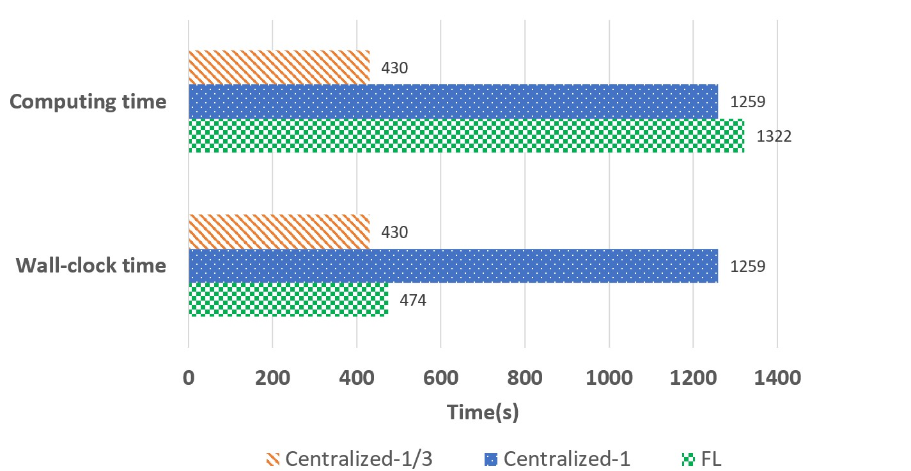
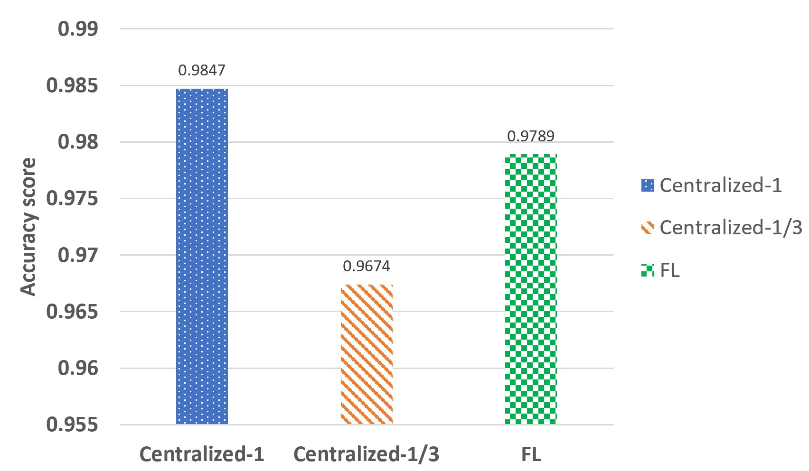
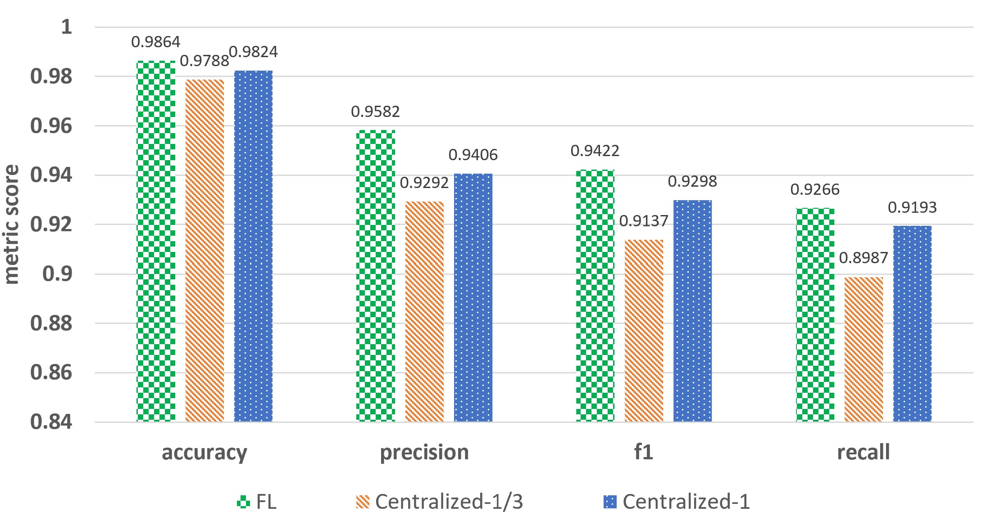
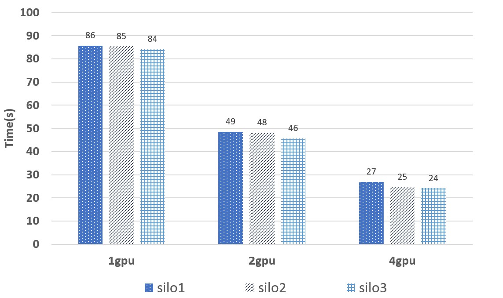
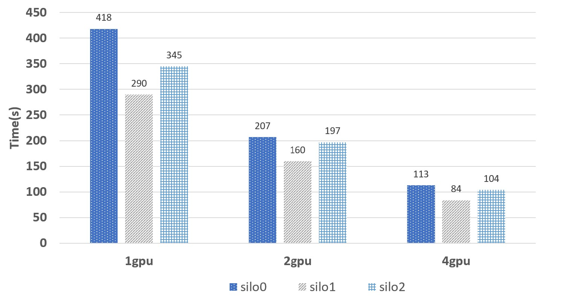

# Real-world Example Benchmarks
For all three real-word examples (PNEUMONIA, NER, CCFRAUD) available in this repository, we performed a benchmark assess three main aspects: the training overhead, model performance, and scalability of training under the FL framework. The results show that the FL on AzureML implementation is:

- **Efficient**: overhead is kept minimal (see [section 2.1](#21-training-overhead))
- **Valid**: reaching parity in quality (see [section 2.2](#22-model-performance))
- **Scalable**: it can adapt to larger datasets by leveraging distributed training (see [section 2.3](#23-scalability-with-training))

The main purpose of this benchmark is to show that FL has been implemented correctly and works as expected, rather than to focus on the exact metric value shown below, which will vary based on distinct models and datasets. In the following [Methodology](#1-methodology) section we'll provide the details on what we used for computes, hyperparameters, models, and tasks etc.

## Table of contents
- [Methodology](#1-methodology)
- [Results](#2-results)
   - [Training Overhead](#21-training-overhead)
   - [Model Performance](#22-model-performance)
   - [Scalability with Training](#23-scalability-with-training)

## 1. Methodology

Before jumping to the benchmarking, we provide a table that gives a description of each example including the type of problem, type of data, number of examples and size on disk:

|  Example  |           Problem         | Type of data | Number of samples | Size on disk |
|:---------:|:-------------------------:|:------------:|:-----------------:|:------------:|
| PNEUMONIA |   Binary Classification   |     Image    |        5856       |    1.24GB    |
|    NER    | Multi-class Classification|     Text     |       164.1K      |     115MB    |
|  CCFRAUD  |   Binary Classification   |    Tabular   |        1.86M      |   501.59MB   |

For the best reproducibility of the benchmark results, here are the hyperparameters used for the experiments:

|  Example  | # Iterations  | # Epochs | Batch size | Learning rate |
|:---------:|:-------------:|:--------:|:----------:|:-------------:|
| PNEUMONIA |       2       |     5    |     32     |      0.01     |
|    NER    |       2       |     3    |     16     |      0.01     |
|  CCFRAUD  |       5       |     10    |     1000    |      0.001    |

For benchmark experiments about training overhead and model performance, we compared three models:

1. __FL__:  model trained with FL in 3 silos. Each silo only gets 1/3 of the data
2. __Centralized-1/3__: 1 centralized model trained with 1/3 data
3. __Centralized-1__: 1 centralized model trained with all data

After each model is trained, it is evaluated with all available test data. In terms of the compute resources, we use the same FL provision of SKUs for each example. Below is a table that summarizes both the characteristics and the computing details for each model:

|  Example        | Fraction of data in each silo | # Silos |                         SKUs                         |  Regions  |
|:---------------:|:-----------------------------:|:-------:|:----------------------------------------------------:|:---------:|
|       FL        |              1/3              |    3    |  STANDARD_DS3_V2(orchestrator), Standard_NV24(silos) |  East US  |
| Centralized-1/3 |              1/3              |    1    |                        Standard_NV24                 |  East US  |
|  Centralized-1  |               1               |    1    |                        Standard_NV24                 |  East US  |

We did use the same region for all FL silos to avoid accounting for regional differences in data loading time. Using different regions might yield different results on training overhead, but not significantly.

## 2. Results

### 2.1 Training Overhead

For training overhead, there are two main questions of interest: 

1. What is the extra **wall-clock time** spent on training with FL, compared to train a regular centralized model only with 1/3 (1/#silo) of the data (_FL_ versus _Centralized-1/3_). Wall-clock time refers to the real-world time elapsed for a job from start to end.
2. What is the extra **computing time** spent on training with FL, compared to train a regular centralized model with data from all silos combined (_FL_ versus _Centralized-1_). Computing time refers to the time spent on all computing resources that the job deployed during training. In case of FL, the computing time should be calculated as the sum of time spent in every silos.

The first point is important as it indicates how quickly customers can get their model results, from job submitted to ended. The second point is essential as it is an indication of the money that customers will spend on all computing resources.  

**Key findings**: Our benchmark indicates that the overhead on wall-clock time (1% up to 7%) and computing time (<5%) remains small, meaning that the FL implementation is efficient.

#### PNEUMONIA

    

For pneumonia, FL takes only 4% longer wall-clock time than centralized-1/3, and about 5% longer computing time than centralized-1.

#### NER

    

For ner, FL takes only 1.3% longer wall time than centralized-1/3, and only 0.1% longer computing time than centralized-1.

#### CCFRAUD

    

For ccfraud, FL takes 7% longer wall time than centralized-1/3 model, while about 2% longer computing time than centralized-1.

### 2.2 Model Performance
Another important assessing factor for FL is the model performance. Here we also aim at two questions:

1. How does the FL model performance compare to the centralized model trained with only partial data (**Centralized-1/3**), which is the scenario when FL is not supported and data are confidential and restricted to each region.  
2. How does the FL model performance compare to the centralized model trained with data from all silos (**Centralized-1**), which is an ideal situation when all data are eyes-on and could be combined.

The first point is to demonstrate the extent of improvements on model performance, when users can use FL to train with much more data from external parties, compared to train with data only from one party. The second point is to understand if the scatter-gather design of FL has impact on the model performance.

**Key findings**: Our benchmark indicates that model performace is boosted with FL comparing to a single model with partial data. It also shows that the model performance with FL is comparable to a single model trained on all data, demonstrating the validity of our implementation.

#### PNEUMONIA

    

For pneumonia, FL achieves higher accuracy than centralized-1/3, while slightly lower than centralized-1.

#### NER

    

For ner, FL achieves a highest score for all four metrics. Although it is not expected that FL will outperform centeralized-1, it might be because the scatter-aggregate fashion improves the generalizability of the final model.

#### CCFRAUD

    

For ccfraud, FL shows comparable performance to centralized-1 in recall and auc, while lower in precision. On the other hand, FL achieves higher scores for all metrics compared to centralized-1/3.

### 2.3 Scalability with Training

Scalability is critical for industry applications of FL on large datasets. One benefit of using FL on Azure ML is that it supports distributed training (multi GPUs and multi nodes). For this reason, we support distributed training for each real-world example, empowered by Pytorch Distributed Data Parallel (DDP) module. To test the scalability of our implementation, we artificially replicated each datasets by 10 times, and record the training time per epoch for each silo when such data is trained on different number of GPUs and machines. For pneumonia example, we also expanded the data to 1TB to demonstrate the scalability of our implementation in extreme cases.

**Key findings**: Our benchmark results shows that in all 3 scenarios, we can achieve scalability by adding more nodes and gpus to reduce wall time accordingly.

#### PNEUMONIA

    

    

For pneumonia, in both cases (10x on the top, 1TB on the bottom) the training time scales linearly with different number of GPUs for all three silos. For 1TB scenario, given that training was performed on multi-nodes, it demonstrates that the communications among machines are efficient and the overhead is kept at minimum.

#### NER

    

For ner, the training time scales linearly with different number of GPUs for all three silos.

#### CCFRAUD

    

For ccfraud, the training time scales linearly with different number of GPUs for all three silos.
