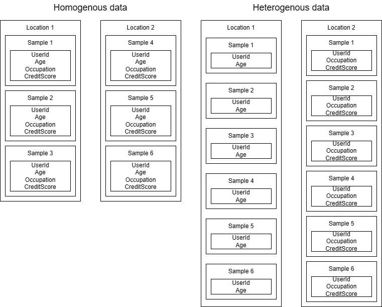
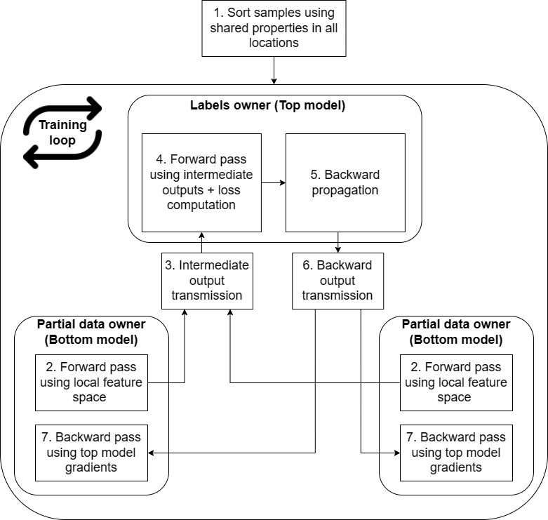

# Cross-silo vertical federated learning

## Background
Vertical federated learning (VFL) is a branch of federated learning where the data are split across the features among the participants rather than across the samples (horizontal FL). In other words we can say that it takes federated learning to another level as it allows for cross-organization collaboration without the need for having the same features, while keeping privacy and security of each individual's data intact. Some of real-world examples include, but are not limited to:
- Finance: several institutions owning different pieces of data about their clients (e.g. bank account data, credit card data, loans data, ...etc)
- Healthcare: different healthcare facilities may own different modalities (e.g. x-ray scans, prescriptions, patient health records, ...etc)
- Retail: each retailer owns different information about customer and aggregating this information may result in better recommendations for the customer

<br/><br/>
<div align="center">
    
</div>

> Note: In this tutorial we refer to the party who owns the data labels (and optionally some features) as the "host", and to parties who only own features (and provide host with intermediate outputs of their share of the network) as "contributors".

## Objective and contents
This tutorial will guide you through the steps required to set up VFL experiments and point out important parts of the code.

Split learning approach is demonstrated in MNIST (written number recognition) and [CCFRAUD (financial tabular data)](../real-world-examples/ccfraud-vertical.md) examples in order to showcase versatility of the solution in regards to type of the data. These two examples make use of mean aggregation, and the assumption is that the host owns only labels while features are equally distributed among the contributors.

We relax this assumption in a third example ([Bank Marketing](../real-world-examples/bank-marketing-vertical.md)), in which the host also owns part of the feature space.

Modified version of the [CCFRAUD (financial tabular data) with FedOnce](../real-world-examples/ccfraud-vetical-fedonce.md) example showcases how to decrease amount of communication required across participants by utilizing Variational Autoencoders.


## Model preparation

### Split learning
It is an ongoing research topic on how the model can be orchestrated in VFL. The most common approach involves splitting the model between the host and contributors, also referred to as **split learning**, this approach can be easily altered by moving layers between parties to hosting whole model on contributors while host provides only aggregation and loss computation. We believe that this can better demonstrate capabilities of VFL on AzureML and most of the existing models can be easily split without requiring too much work.

### FedOnce
Inspired by [work from Wu et. al.](https://arxiv.org/pdf/2208.10278.pdf), we also implemented communication efficient vertical federated learning approach that relies on learning latent representation of data in all contributing parties through unsupervised learning by utilizing Variational Autoencoders (VAE). The latent representation of overlapping samples is shared to host upon convergence of VAEs. This is done only once during the training and thus significantly reduces communication overhead. The host then uses these latent representations to train predictor using labels. Advantage of this approach is that each contributor can fully utilize all samples for training no matter the overlap with other parties due to the nature of unsupervised learning. The step-by-step flow of the training is as follows:
1. Each contributor collects its portion of features and trains the VAE (in case of **CCFRAUD** example this is done by the `ccfraud_vertical_pretrain_contributor` component that can be found in `examples/components/CCFRAUD_VERTICAL_FEDONCE/pretraining`) until convergence.
2. Each contributor stores its model in its own data storage and then stores the latent representations of data in the host storage (in this way the output of each contributor is transferred only once compared to regular VFL where number of transfers of all data is equal to number of epochs).
3. Host loads the data labels as well as all the latent representations created by the contributors and use them for training its portion of the model until convergence.

## Communication
The nodes in the vertical federated learning need to communicate during the training to exchange intermediate outputs and gradients. Current implementation enables communication only between the host and contributors and no contributor to contributor access. The communication can happen on one of the two currently available channels: **sockets** or **Redis streams**.

> Note: this section does not apply for **FedOnce** approach as it does not require communication during training.

### Sockets
This is easier to start with as the only **requirement here is that the nodes are interconnected using vnet**. This is also the **default option**. To create this type of communication channel just create instance of a **AMLCommSocket** class with world size, rank of the node and root run id.

### Redis streams
In case it is not feasible to use vnets in your case you can fall back on using Redis. This, however, involves provisioning [Azure Cache for Redis](https://azure.microsoft.com/en-us/products/cache/). Please, make sure that you provision at least **P1 Premium Instance with 6GB cache** for the demos. However, if you would like to use it for your own data and architectures, feel free to scale it according to the needs for messages being sent between the nodes. The reason why we recommend **Premium tier** is due to the network latency and throughput, more information can be found [here](https://learn.microsoft.com/en-us/azure/azure-cache-for-redis/cache-best-practices-performance).

Once you provision *Azure Cache for Redis* (this can be provisioned in whichever subscription you like):
1. Go to *Access keys* and copy *Primary connection string*. 
2. Go to your *Azure Machine Learning workspace* in Azure Portal and click on the *Key Vault* item.
3. Open "Access Policies" tab and click "Create".
4. Select *List, Set & Delete* right under "Secret Management Operations" and press "Next".
5. Lookup currently logged in user (using user id or an email), select it and press "Next".
6. Press "Next" and "Create" in the next screens. We are now able to create a secret in the key vault.
7. Go to *Secrets* and *Generate* new one with previously copied connection string and the following name "amlcomm-redis-connection-string".
8. In your pipeline configuration file change `communication_backend` value from `socket` to `redis`
9. Continue to training section

## Communication encryption

The communication between nodes, which includes intermediate outputs and gradients, can be optionally encoded. This may be very important in case of using *Redis* as communication backend. To enable the encryption follow these steps:

1. Open the config file  `config.yaml` in `examples/pipelines/<example-name>/`
2. Set `encrypted` field, under `communication` to `true`

## Private Set Intersection
Parties collaborating in the vertical federated learning may own non-overlapping samples. Therefore, ahead of training or testing, it's necessary to make sure that only intersection of these samples is used. Looking for an intersection may result in oversharing data by revealing information about possession of samples not present in other parties. The secure way to achieve this is to use **private set intersection** approach that utilizes cryptography to find an intersection among samples without revealing sets of samples present on individual parties. Example uses case can be found in `examples/component/CCFRAUD_VERTICAL/psi`.

### How does the encryption works?
Whole encryption is handled by `AMLSPMC` class in `examples/components/<example-name>/aml_smpc.py`. By initiating the class every node generates its own public/private key set. The public part is communicated to other parties, which they use when communicating with this node. Thus, the private part resides at all time on the local node and is well protected. The message itself is encrypted using hybrid encryption, which can be broken down as follows:

**Encryption:** Firstly, the data are encoded using symmetric key, new symmetric key is generated for every message. Afterwards, this symmetric key is encoded using public key of receiving party and attached to the message.

**Decryption:** Firstly, receiving party decodes the symmetric key using its private key and afterwards the data are decoded using this symmetric key.

## Training

### Overview
Now, before we run the training itself let's take a step back and take a look on how such training works in VFL setup that is roughly depicted in the figure below. The first step that needs to take place ahead of the training is:

- **Private entity intersection and alignment** - before the training takes place we need to make sure that all of the parties involved share the same sample space and these samples are aligned during the training. **Our samples provide these guarantees by design but please make sure it's true for your custom data. This can be achieved by, for example, by providing preprocessing step before training like PSI step in the CCFRAUD_VERTICAL example.**

Afterwards, we can continue with regular training loop:
- **Forward pass in contributors** - all contributors, and optionally host, perform forward pass on their part of the model with features they own
- **Intermediate outputs transfer** - all outputs from previous step are sent to the host that performs an aggregation (for simplicity sake we make use of mean operation)
- **Loss computation** - host performs either forward pass on its part of network or just passes aggregated outputs of previous step through an activation function followed by loss computation
- **Gradients computation** - if host owns some part of the network, it performs backward pass, followed by computing gradients w.r.t inputs in all cases
- **Gradient transfer** - all contributors, and optionally host, receives gradients w.r.t. their intermediate outputs
- **Backward pass** - gradients are used to perform backward pass and update the network weights

<br/><br/>
<div align="center">
    
</div>

## MNIST Example
Following steps provides you with basic setup for vertical federated learning solution. For simplicity we are using MNIST dataset but for more advanced datasets and tutorials please follow links in the [section](#objective-and-contents) above.
### Infrastructure
First step towards successfully running a VFL example is to provision an infrastructure. In order to do so, please navigate to [quickstart](../quickstart.md) and use the **single-button deployment for vnet infrastructure deployment**. This is necessary in order for nodes to be able to communicate.

### Install the required dependencies
You will need python to submit experiments to AzureML. You can install the required dependencies by running:

```bash
conda env create --file ./examples/pipelines/environment.yml
conda activate fl_experiment_conda_env
```

Alternatively, you can just install the required dependencies:

```bash
python -m pip install -r ./examples/pipelines/requirements.txt
```

### Data provisioning
The data format for VFL is different from regular FL. That is why each of our examples contains its own script for uploading training and validation data.

> Note: This will split the data such that each contributor owns its portion of the features and the host owns only the labels (except for the Bank Marketing Prediction example).

Uploading the data can  be performed with ease using a data provisioning pipeline. To run it follow these steps:

1. If you are not using the quickstart setup, adjust the config file  `config.yaml` in `examples/pipelines/utils/upload_data/` to match your setup.

2. Submit the experiment by running:

   ```bash
   python ./examples/pipelines/utils/upload_data/submit.py --example MNIST_VERTICAL --workspace_name "<workspace-name>" --resource_group "<resource-group-name>" --subscription_id "<subscription-id>"
   ```

   > Note: You can use the `--offline` flag when running the job to just build and validate the pipeline without submitting it.

    :star: You can simplify this command by entering your workspace details in the file `config.yaml` in this same directory.

:warning: Proceed to the next step only once the pipeline completes. This pipeline will create data in 3 distinct locations.

### Training
1. If you are not using the quickstart setup, adjust the config file  `config.yaml` in `examples/pipelines/<example-name>/` to match your setup.

2. Submit the experiment by running:

   ```bash
   python ./examples/pipelines/mnist_vertical/submit.py --config examples/pipelines/mnist_vertical/config.yaml --workspace_name "<workspace-name>" --resource_group "<resource-group-name>" --subscription_id "<subscription-id>"
   ```

   > Note: You can use the `--offline` flag when running the job to just build and validate pipeline without submitting it.

    :star: you can simplify this command by entering your workspace details in the file `config.yaml` in this same directory.

## Tips and pitfalls
1. **Socket timeout**
   If you happen to get `socket.timeout: timed out` error when launching the training this means that some of the nodes were not able to connect to the training in the threshold (10 minutes). Please make sure your nodes are up and **relaunch the training**.
2. **Vertical Federated Learning comes at a cost**
    There is significant overhead when launching vertical federated learning due to heavy communication among participants. As we can see in the training loop there are two transfers per each mini-batch. One for forward pass outputs, one for gradients. This means that the training may take longer than expected.
3. **Intersection and entity alignment**
   The samples, used for training and testing, must be aligned and form an intersection of all samples across participants. This process may result in oversharing and revealing private information to other participants. Fortunately there are **private set intersection** methods available out there that come to rescue. For more details checkout PSI step in **CCFRAUD_VERTICAL** example pipeline.
4. **Communication encryption**
    Even though the intermediate outputs and gradients are not raw data, they still have been inferred using private data. Therefore, it's good to use encryption when communicating the data to parties outside of Azure.
