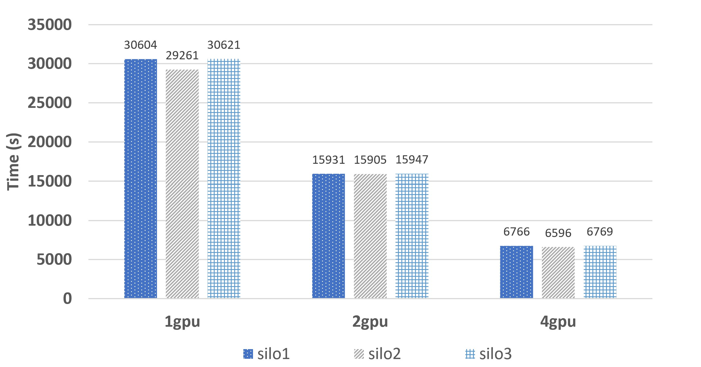

# Real-world Example Benchmarks
For all three real-word examples (PNEUMONIA, NER, CCFRAUD) we perform benchmark testing to assess three main factors --- The training overhead, the model performance, and the scalability of training under FL setting. The main purpose of this benchmark is to show that FL has been implemented correctly and work as expected, rather than to focus on the exact metric value shown below, which will largely vary with both models and datasets. In the following experiment, each silo is trained with the same hyperparameters to ensure the consistency of results and below are the results from each of the aspect.

## Table of contents

- [Training Overhead](#real-world-example-benchmarks)
- [Model Performance](#model-performance)
- [Scalability with Training](#scalability-with-training)

## Training Overhead

For training overhead, the main question of interest is mainly two-fold: 1. what is the extra wall-clock time spent on training with FL, compared to train 1 regular centralized model, but only with 1/#silo of the data. 2. what is the extra computing time spent on the training with FL, compared to train 1 regular centralzied model with data from all silos combined. Thie first point is important as they indicate the how quickly customers can get their models results, and the second point is essential as an indication of the money that customers will spend on training. For this reason, we tested 3 models -- "FL" for model trained with FL in 3 silos, "Centralized-1/3" for 1 model with 1/3 data, and "Centralized-1" for 1 model with all data combined. 

### PNEUMONIA

    

For pneumonia, FL takes only 4% longer wall-clock time than centralized-1/3, and about 5% longer computing time than centralized-1

### NER

    

For ner, FL takes only 1.3% longer wall time than centralized-1/3, and only 0.1% longer computing time than centralized-1

### CCFRAUD

    

For ccfraud, FL takes 10% longer wall time than centralized model, while about 3% longer computing time than centralized-1

## Model Performance
Another important factor/metric that can assess the performance of FL is the model performance. Here we also aims to answer two questions 1. how does the FL model performance compare to the centralized model trained with only partial data, which is the scenario when FL is not supported and data are also restricted to each region. 2. How does the FL model performace compare to the centralized model training with all data combined, which is an ideal situation when all data could be combined. This is to understand if the distributed-aggregate design of FL has impact on the model performance. For this reason, we tested 3 models -- "FL" for model trained with FL in 3 silos, "Centralized-1/3" for 1 model with 1/3 data, and "Centralized-1" for 1 model with all data combined. 

### PNEUMONIA

    

For pneumonia, FL achieves higher accuracy than centralized-1/3, while slightly lower than centralized-1

### NER

    

For ner, FL achieves the highest score for all four metrics. Although it is not expected that FL will outperform centeralized-1, it might be becasue that the distributed-aggreagte fashion improves the generalizability of he final model.

## Scalability with Training

For each real-world example, we also support distributed training within each silo, with Pytorch Distributed Data Parallel (DDP) module. To test the scalability of our implementation, we artifically replicated each datasets by 10 times, and record the training time per epoch for each silo when such data train on different number of GPUs.

### PNEUMONIA

    

For pneumonia, the training time scales linearly with different number of GPUs for all three silos.

### NER

    

For ner, the training time scales linearly with different number of GPUs for all three silos.

### CCFRAUD

    

For ccfraud, the training time scales linearly with different number of GPUs for all three silos.
