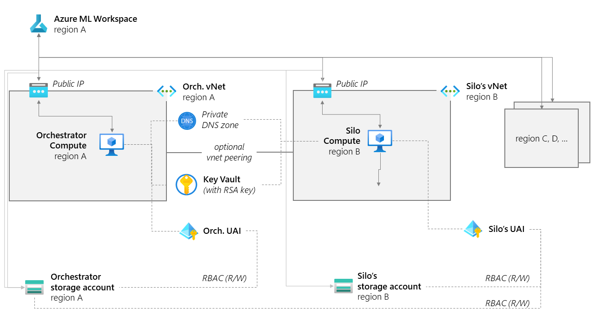
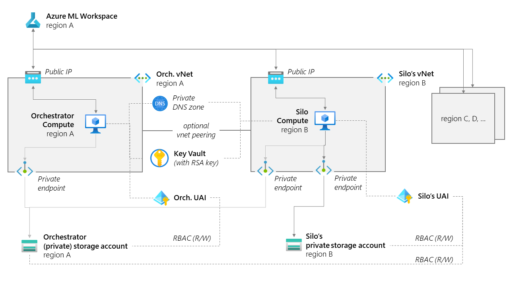
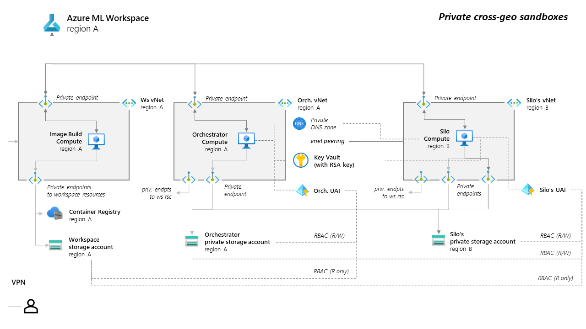

# Azure ML Federated Learning Sandboxes

This page describes the different sandboxes that you can **fully provision and use out-of-the-box** with our [real-world examples](../real-world-examples/). Each sandbox has distinct properties depending on what you'd like to test.

- [Minimal sandbox](#minimal-sandbox) : the quickest path to a demo environment (only horizontal FL)
- [Eyes-on sandboxes](#eyes-on-sandboxes) : a sandbox where you can debug your code, but the data is still accessible by the users of your subscription
- [Eyes-off sandboxes](#eyes-off-sandboxes) : a sandbox where the data is kept in storages without public network access, and only accessible by the computes through a vnet
- [Private sandboxes](#private-sandboxes) : an eyes-off sandbox where the Azure ML workspace and resources are also protected behind a vnet
- [Confidential VM sandboxes](#confidential-sandboxes) : a sandbox where the data is kept in storages without public network access, and only accessible by the computes through a vnet, and the computes are Confidential VMs
- [Configurable sandboxes](#configurable-sandboxes) : at the root of our eyes-on/eyes-off sandboxes, these bicep scripts allow you to modify multiple parameters to fit your needs.

:rotating_light: :rotating_light: :rotating_light: **IMPORTANT: These sandboxes require you to be the _Owner_ of an Azure resource group.** _Contributor_ role is not enough. In your subscription, depending on admin policies, even if you can create a resource group yourself, you might not be the _Owner_ of it. Without ownership, you will not be able to set the RBAC roles necessary for provisioning these sandboxes. Ask your subscription administrator for help.

## Minimal sandbox

Deploy a completely open sandbox to allow you to try things out in an eyes-on environment. This setup is intended **only for demo** purposes. The data is still accessible by the users of your subscription when opening the storage accounts, and data exfiltration is possible. This supports only Horizontal FL scenarios.

[](https://portal.azure.com/#create/Microsoft.Template/uri/https%3A%2F%2Fraw.githubusercontent.com%2FAzure-Samples%2Fazure-ml-federated-learning%2Fmain%2Fmlops%2Farm%2Fsandbox_minimal.json)

### :exclamation: Important parameters

| Parameter | Description | Values |
| --- | --- | --- |
| **compute1SKU** | SKU of the first compute to provision.| ex: `Standard_DS4_v2` |
| **siloRegions** | List of regions used for the silos. All our samples work with 3 regions. | ex: `["australiaeast", "eastus", "westeurope"]` |
| **kaggleUsername** and **kaggleKey** | Optional: some of our samples require kaggle credentials to download datasets, this will ensure the credentials get injected in the workspace secret store properly (you can also [do that manually later](../tutorials/add-kaggle-credentials.md)). |

### Relevant Documentation

To manually reproduce this full provisioning, see relevant documentation:

- [Create workspace resources you need to get started with Azure Machine Learning](https://learn.microsoft.com/en-us/azure/machine-learning/quickstart-create-resources)
- [Manage user-assigned managed identities](https://learn.microsoft.com/en-us/azure/active-directory/managed-identities-azure-resources/how-manage-user-assigned-managed-identities)

## Eyes-on sandboxes

Deploy a sandbox where computes are located in a vnet, and can communicate with one another for Vertical FL through vnet peering, but the storages remain eyes-on to allow for debugging. This is recommended for a good sandbox for figuring things out on synthetic data.

These sandboxes are typical of a cross-geo federated learning scenario. Each silo is provisioned with a single-tenant, but in different regions.

| Deploy | Description |
| :-- | :-- |
| [](https://portal.azure.com/#create/Microsoft.Template/uri/https%3A%2F%2Fraw.githubusercontent.com%2FAzure-Samples%2Fazure-ml-federated-learning%2Fmain%2Fmlops%2Farm%2Fsandbox_fl_eyeson_cpu.json) | Eyes-on with 1 CPU compute per silo |
| [](https://portal.azure.com/#create/Microsoft.Template/uri/https%3A%2F%2Fraw.githubusercontent.com%2FAzure-Samples%2Fazure-ml-federated-learning%2Fmain%2Fmlops%2Farm%2Fsandbox_fl_eyeson_gpu.json) | Eyes-on with 1 GPU compute per silo |
| [](https://portal.azure.com/#create/Microsoft.Template/uri/https%3A%2F%2Fraw.githubusercontent.com%2FAzure-Samples%2Fazure-ml-federated-learning%2Fmain%2Fmlops%2Farm%2Fsandbox_fl_eyeson_cpu_gpu.json) | Eyes-on with 2 computes per silo (1 CPU, 1 GPU) |

### :exclamation: Important parameters

| Parameter | Description | Values |
| --- | --- | --- |
| **primarySKU** | SKU of the first compute to provision.| ex: `Standard_DS4_v2` |
| **secondarySKU** | SKU of the second compute to provision. | ex: `STANDARD_NC6` |
| **siloRegions** | List of regions used for the silos. All our samples work with 3 regions. | ex: `["australiaeast", "eastus", "westeurope"]` |
| **applyVNetPeering** | Peer the silo networks to the orchestrator network to allow for live private communication between jobs (required for Vertical FL). | `true` or `false` |
| **kaggleUsername** and **kaggleKey** | Optional: some of our samples require kaggle credentials to download datasets, this will ensure the credentials get injected in the workspace secret store properly (you can also [do that manually later](../tutorials/add-kaggle-credentials.md)). |

### Architecture



### Relevant Documentation

To manually reproduce this full provisioning, see relevant documentation:

- [Compute instance/cluster with public IP](https://learn.microsoft.com/en-us/azure/machine-learning/how-to-secure-training-vnet?tabs=cli%2Crequired#compute-instancecluster-with-public-ip)
- create a new [vnet and subnet](https://learn.microsoft.com/en-us/azure/virtual-network/virtual-networks-overview), with a [network security group](https://learn.microsoft.com/en-us/azure/virtual-network/network-security-groups-overview)
- create a new [managed identity](https://learn.microsoft.com/en-us/azure/active-directory/managed-identities-azure-resources/overview) (User Assigned) to manage permissions of the compute
- create a new [storage account](https://docs.microsoft.com/en-us/azure/storage/common/storage-account-overview) in a given region

## Eyes-off sandboxes

Deploy a sandbox where the silos storages are kept eyes-off by a private service endpoint, accessible only by the computes through a vnet. This sandbox is typical of a cross-geo federated learning scenario. Each silo is provisioned with a single-tenant, but in different regions. Each silo has a distinct virtual network enabling private communication between the silo compute and the silo storage.

| Deploy | Description |
| :-- | :-- |
| [](https://portal.azure.com/#create/Microsoft.Template/uri/https%3A%2F%2Fraw.githubusercontent.com%2FAzure-Samples%2Fazure-ml-federated-learning%2Fmain%2Fmlops%2Farm%2Fsandbox_fl_eyesoff_cpu.json) | Eyes-off with 1 CPU compute per silo |
| [](https://portal.azure.com/#create/Microsoft.Template/uri/https%3A%2F%2Fraw.githubusercontent.com%2FAzure-Samples%2Fazure-ml-federated-learning%2Fmain%2Fmlops%2Farm%2Fsandbox_fl_eyesoff_gpu.json) | Eyes-off with 1 GPU compute per silo |
| [](https://portal.azure.com/#create/Microsoft.Template/uri/https%3A%2F%2Fraw.githubusercontent.com%2FAzure-Samples%2Fazure-ml-federated-learning%2Fmain%2Fmlops%2Farm%2Fsandbox_fl_eyesoff_cpu_gpu.json) | Eyes-off with 2 computes per silo (1 CPU, 1 GPU) |

### :exclamation: Important parameters

| Parameter | Description | Values |
| --- | --- | --- |
| **primarySKU** | SKU of the first compute to provision.| ex: `Standard_DS4_v2` |
| **secondarySKU** | SKU of the second compute to provision. | ex: `STANDARD_NC6` |
| **siloRegions** | List of regions used for the silos. All our samples work with 3 regions. | ex: `["australiaeast", "eastus", "westeurope"]` |
| **orchestratorEyesOn** | Sets the orchestrator network access to either public (`true`) or private (`false`, default). |  `true` or `false` |
| **applyVNetPeering** | Peer the silo networks to the orchestrator network to allow for live private communication between jobs (required for Vertical FL). | `true` or `false` |
| **kaggleUsername** and **kaggleKey** | Optional: some of our samples require kaggle credentials to download datasets, this will ensure the credentials get injected in the workspace secret store properly (you can also [do that manually later](../tutorials/add-kaggle-credentials.md)). |

### Architecture



### Relevant Documentation

To manually reproduce this full provisioning, see relevant documentation:

- [Compute instance/cluster with public IP](https://learn.microsoft.com/en-us/azure/machine-learning/how-to-secure-training-vnet?tabs=cli%2Crequired#compute-instancecluster-with-public-ip)
- create a new [vnet and subnet](https://learn.microsoft.com/en-us/azure/virtual-network/virtual-networks-overview), with a [network security group](https://learn.microsoft.com/en-us/azure/virtual-network/network-security-groups-overview)
- create a new [managed identity](https://learn.microsoft.com/en-us/azure/active-directory/managed-identities-azure-resources/overview) (User Assigned) to manage permissions of the compute
- create a new [storage account](https://docs.microsoft.com/en-us/azure/storage/common/storage-account-overview) in a given region, with a [private endpoint](https://learn.microsoft.com/en-us/azure/storage/common/storage-private-endpoints) inside the vnet

## Private sandboxes

This is an eyes-off sandbox, but in addition the Azure ML workspace and all its related resources (container registry, keyvault, etc) are also provisioned behind a vnet. All those are made accessible to each silo by private endpoints.

| Deploy | Description |
| :-- | :-- |
| [](https://portal.azure.com/#create/Microsoft.Template/uri/https%3A%2F%2Fraw.githubusercontent.com%2FAzure-Samples%2Fazure-ml-federated-learning%2Fmain%2Fmlops%2Farm%2Fsandbox_fl_private_cpu.json) | Private with 1 CPU compute per silo |
| [](https://portal.azure.com/#create/Microsoft.Template/uri/https%3A%2F%2Fraw.githubusercontent.com%2FAzure-Samples%2Fazure-ml-federated-learning%2Fmain%2Fmlops%2Farm%2Fsandbox_fl_private_gpu.json) | Private with 1 GPU compute per silo |
| [](https://portal.azure.com/#create/Microsoft.Template/uri/https%3A%2F%2Fraw.githubusercontent.com%2FAzure-Samples%2Fazure-ml-federated-learning%2Fmain%2Fmlops%2Farm%2Fsandbox_fl_private_cpu_gpu.json) | Private with 2 computes per silo (1 CPU, 1 GPU) |

### :exclamation: Important parameters

| Parameter | Description | Values |
| --- | --- | --- |
| **primarySKU** | SKU of the first compute to provision.| ex: `Standard_DS4_v2` |
| **secondarySKU** | SKU of the second compute to provision. | ex: `STANDARD_NC6` |
| **siloRegions** | List of regions used for the silos. All our samples work with 3 regions. | ex: `["australiaeast", "eastus", "westeurope"]` |
| **workspaceNetworkAccess** | To make it easier to debug, use `public` to make the Azure ML workspace accessible through its public IP in the Azure portal (default: public). |  `public` or `private` |
| **applyVNetPeering** | Peer the silo networks to the orchestrator network to allow for live private communication between jobs (required for Vertical FL). | `true` or `false` |
| **kaggleUsername** and **kaggleKey** | Optional: some of our samples require kaggle credentials to download datasets, this will ensure the credentials get injected in the workspace secret store properly (you can also [do that manually later](../tutorials/add-kaggle-credentials.md)). |

### Architecture



### Relevant Documentation

To manually reproduce this full provisioning, see relevant documentation:

- [Secure an Azure Machine Learning workspace with virtual networks](https://learn.microsoft.com/en-us/azure/machine-learning/how-to-secure-workspace-vnet)
- [Compute instance/cluster with private IP](https://learn.microsoft.com/en-us/azure/machine-learning/how-to-secure-training-vnet?tabs=cli%2Crequired&view=azureml-api-2#compute-instancecluster-with-no-public-ip)
- create a new [vnet and subnet](https://learn.microsoft.com/en-us/azure/virtual-network/virtual-networks-overview), with a [network security group](https://learn.microsoft.com/en-us/azure/virtual-network/network-security-groups-overview)
- create a new [managed identity](https://learn.microsoft.com/en-us/azure/active-directory/managed-identities-azure-resources/overview) (User Assigned) to manage permissions of the compute
- create a new [storage account](https://docs.microsoft.com/en-us/azure/storage/common/storage-account-overview) in a given region, with a [private endpoint](https://learn.microsoft.com/en-us/azure/storage/common/storage-private-endpoints) inside the vnet

## Confidential sandboxes

Deploy an eyes-off sandbox where the computes leverage confidential computing to keep your training and processing within an enclave.

| Deploy | Description |
| :-- | :-- |
| [](https://portal.azure.com/#create/Microsoft.Template/uri/https%3A%2F%2Fraw.githubusercontent.com%2FAzure-Samples%2Fazure-ml-federated-learning%2Fmain%2Fmlops%2Farm%2Fsandbox_fl_confidential.json) | A sandbox with AKS clusters with confidential computes per silo and orchestrator. |

Note: to take full benefit of the VMs, you will need to finalize the setup of the AKS cluster by [creating an instance type and use it in pipeline configs](./silo_open_aks_with_cc.md#create-instancetype).

### :exclamation: Important parameters

| Parameter | Description | Values |
| --- | --- | --- |
| **computeSKU** | VM to provision in the AKS cluster (default will use [a CVM from dcasv5](https://learn.microsoft.com/en-us/azure/virtual-machines/dcasv5-dcadsv5-series)). You can also use any non-confidential SKU. | ex: `Standard_DC4as_v5` |
| **siloRegions** | List of regions used for the silos. All our samples work with 3 regions. :exclamation: make sure you have quota in those regions for confidential compute in particular. | ex: `["australiaeast", "eastus", "westeurope"]` |
| **orchestratorEyesOn** | Sets the orchestrator network access to either public (`true`) or private (`false`, default). |  `true` or `false` |
| **applyVNetPeering** | Peer the silo networks to the orchestrator network to allow for live private communication between jobs (required for Vertical FL). | `true` or `false` |
| **kaggleUsername** and **kaggleKey** | Optional: some of our samples require kaggle credentials to download datasets, this will ensure the credentials get injected in the workspace secret store properly (you can also [do that manually later](../tutorials/add-kaggle-credentials.md)). |

### Architecture

Note: in current sandbox, we're provisioning only in the `eastus` region by default, to allow for capacity and quick deployment.


### Relevant Documentation

To manually reproduce this full provisioning, see relevant documentation:

- [Secure an Azure Machine Learning workspace with virtual networks](https://learn.microsoft.com/en-us/azure/machine-learning/how-to-secure-workspace-vnet)
- [Introduction to Kubernetes compute target in Azure Machine Learning](https://learn.microsoft.com/en-us/azure/machine-learning/how-to-attach-kubernetes-anywhere)
- [DCasv5 and DCadsv5-series confidential VMs](https://learn.microsoft.com/en-us/azure/virtual-machines/dcasv5-dcadsv5-series)
- [Quickstart: Deploy an AKS cluster with confidential computing Intel SGX agent nodes by using the Azure CLI](https://learn.microsoft.com/en-us/azure/confidential-computing/confidential-enclave-nodes-aks-get-started)
- [Network concepts for applications in Azure Kubernetes Service (AKS)](https://learn.microsoft.com/en-us/azure/aks/concepts-network)
- [How to deploy Kubernetes extension](https://learn.microsoft.com/en-us/azure/machine-learning/how-to-deploy-kubernetes-extension?tabs=deploy-extension-with-cli)
- [How to attach Kubernetes to Workspace](https://learn.microsoft.com/en-us/azure/machine-learning/how-to-attach-kubernetes-to-workspace?tabs=cli)
- [Manage user-assigned managed identities](https://learn.microsoft.com/en-us/azure/active-directory/managed-identities-azure-resources/how-manage-user-assigned-managed-identities)


## Configurable sandboxes

In this section, we'll expose the generic sandbox provisioning scripts we're using to create the sandboxes above. Feel free to adapt the parameters to your own needs.

### Using the Azure Portal

| Deploy | Description |
| :-- | :-- |
| [](https://portal.azure.com/#create/Microsoft.Template/uri/https%3A%2F%2Fraw.githubusercontent.com%2FAzure-Samples%2Fazure-ml-federated-learning%2Fmain%2Fmlops%2Farm%2Fvnet_publicip_sandbox_setup.json) | Deploy a sandbox with a vnet and public IP for the orchestrator, either eyes-on/eyes-off, vnet peering or not. |
| [](https://portal.azure.com/#create/Microsoft.Template/uri/https%3A%2F%2Fraw.githubusercontent.com%2FAzure-Samples%2Fazure-ml-federated-learning%2Fmain%2Fmlops%2Farm%2Fvnet_publicip_sandbox_aks_confcomp_setup.json) | Deploy a sandbox with a vnet and public IP for the orchestrator, using confidential computes in AKS, either eyes-on/eyes-off, vnet peering or not. |

### Using bicep

In this section, we will use [bicep](https://learn.microsoft.com/en-us/azure/azure-resource-manager/bicep/overview) scripts to automatically provision a set of resources for an FL sandbox.

1. Using the [`az` cli](https://learn.microsoft.com/en-us/cli/azure/install-azure-cli), log into your Azure subscription:

    ```bash
    az login
    az account set --name <subscription name>
    ```

2. Optional: Create a new resource group for the demo resources. Having a new group would make it easier to delete the resources afterwards (deleting this RG will delete all resources within).

    ```bash
    # create a resource group for the resources
    az group create --name <resource group name> --location <region>
    ```

    > Notes: If you have _Owner_ role only in a given resource group (as opposed to in the whole subscription), just use that resource group instead of creating a new one.

3. Run the bicep deployment script in a resource group you own:

    ```bash
    # deploy the demo resources in your resource group
    az deployment group create --template-file ./mlops/bicep/vnet_publicip_sandbox_setup.bicep --resource-group <resource group name> --parameters demoBaseName="fldemo"
    ```

    > Notes:
    >
    > - If someone already provisioned a demo with the same name in your subscription, change `demoBaseName` parameter to a unique value.
    > - By default, only one CPU compute is created for each silo. Please set the `compute2` parameter to `true` if you wish to create both CPU & GPU computes for each silo.
    > - Some regions don't have enough quota to provision GPU computes. Please look at the headers of the `bicep` script to change the `region`/`computeSKU`.

4. Alternatively, you can provision the confidential compute sandbox the same way:

    ```bash
    # deploy the demo resources in your resource group
    az deployment group create --template-file ./mlops/bicep/vnet_publicip_sandbox_aks_confcomp_setup.bicep --resource-group <resource group name> --parameters demoBaseName="fldemo"
    ```
