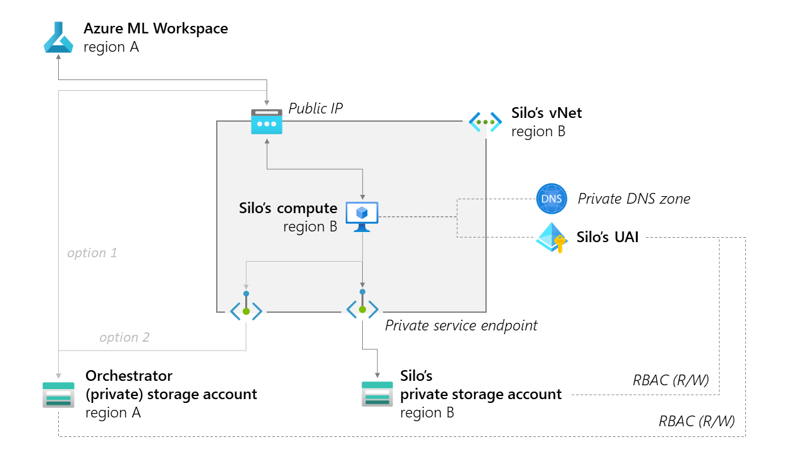

# Create a silo behind a vnet with a new private storage

This tutorial applies in the case you want to create a **completely new storage** account in a federated learning silo in a given region.

## Table of contents

- [Prerequisites](#prerequisites)
- [Important: understand the design](#important-understand-the-design)
- [Create a compute and storage pair for the silo](#create-a-compute-and-storage-pair-for-the-silo)
  - [Using one click deployment](#using-one-click-deployment)
  - [Using az cli](#using-az-cli)
- [Set up interactions with the orchestrator](#set-up-interactions-with-the-orchestrator)

## Prerequisites

To run these deployment options, you first need:

- an existing Azure ML workspace (see [cookbook](README.md))
- an existing private DNS zone for storage, named `privatelink.blob.core.windows.net` (see below)
- have permissions to create resources, set permissions, and create identities in this subscription (or at least in one resource group),
  - Note that to set permissions, you typically need _Owner_ role in the subscription or resource group - _Contributor_ role is not enough. This is key for being able to _secure_ the setup.
- Optional: [install the Azure CLI](https://learn.microsoft.com/en-us/cli/azure/install-azure-cli).

> **To create a private DNS zone**  
> If you don't already have one, you will need to [manually create a private DNS zone](https://learn.microsoft.com/en-us/azure/dns/private-dns-privatednszone) for the storage account and compute of this pair.  
> To do that, go to the Azure portal, and in the resource group of your AzureML workspace, create a new private DNS zone named `privatelink.blob.core.windows.net`.  
> You only need one unique zone for all the pairs you create (both orchestrator and silos). All private DNS entries will be written in that single zone.

## Important: understand the design

In this tutorial, we're provisioning the resources according to the following schema. In this design, the silo is located in a region that is distinct from the Azure ML workspace and the orchestrator storage account.

If any of that design doesn't fit your requirements, feel free to check out the bicep provisioning script [`vnet_compute_storage_pair.bicep`](/mlops/bicep/modules/fl_pairs/vnet_compute_storage_pair.bicep) and adapt it to your needs. Also please give us feedback by filing an issue in this repo.



The provisioning script will:

- create a new [vnet and subnet](https://learn.microsoft.com/en-us/azure/virtual-network/virtual-networks-overview), with a [network security group](https://learn.microsoft.com/en-us/azure/virtual-network/network-security-groups-overview),
- create a new [managed identity](https://learn.microsoft.com/en-us/azure/active-directory/managed-identities-azure-resources/overview) (User Assigned) to manage permissions of the compute,
- create a new [storage account](https://docs.microsoft.com/en-us/azure/storage/common/storage-account-overview) in a given region, with a [private endpoint](https://learn.microsoft.com/en-us/azure/storage/common/storage-private-endpoints) inside the vnet,
- register this storage account as a datastore in the Azure ML workspace,
- create a new Azure ML [compute](https://docs.microsoft.com/en-us/azure/machine-learning/concept-compute-instance) in the same region as the storage, inside the vnet, with a public IP enabled to interact with the Azure ML workspace (with an NSG to restrict access to the orchestrator IP address).

In this scenario, the silo's blob storage account's networking settings are such that **public network access is disabled** (`publicNetworkAccess:false`). The compute can access it thanks to the private endpoint, and the UAI being given R/W permissions to the storage.

> :point_up: **Why is it relevant?** According to docs on [private endpoints for Azure Storage](https://learn.microsoft.com/en-us/azure/storage/common/storage-private-endpoints):  
> _You can use private endpoints for your Azure Storage accounts to allow clients on a virtual network (VNet) to securely access data over a Private Link. The private endpoint uses a separate IP address from the VNet address space for each storage account service. **Network traffic between the clients on the VNet and the storage account traverses over the VNet and a private link on the Microsoft backbone network, eliminating exposure from the public internet**._  
>  
> _Using private endpoints for your storage account enables you to:_  
>
> - _Secure your storage account by configuring the storage firewall to block all connections on the public endpoint for the storage service._
> - _Increase security for the virtual network (VNet), by enabling you to block exfiltration of data from the VNet._

In addition, the compute can interact with the **orchestrator storage account**. This storage account can either be 1) "public" meaning only regulated by RBAC, accessible through the public IP and API or 2) private and accessible only through an endpoint. Both options, and their corresponding RBAC roles and private endpoint provisioning have to be **set up separately** (see below).

## Create a compute and storage pair for the silo

> Note: both [orchestrator](./orchestrator_vnet.md) and silo can be deployed using the same arm/bicep script, changing **Pair Base Name** and `storagePublicNetworkAccess` accordingly.

:important: make sure the subnet address space is not overlapping with any other subnet in your vnet, in particular that it is unique accross all your silos and orchestrator. For instance you can use `10.0.0.0/24` for the orchestrator, then `10.0.N.0/24` for each silo, with a distinct N value.

### Using one click deployment

1. Click on [](https://portal.azure.com/#create/Microsoft.Template/uri/https%3A%2F%2Fraw.githubusercontent.com%2FAzure-Samples%2Fazure-ml-federated-learning%2Fmain%2Fmlops%2Farm%2Fvnet_compute_storage_pair.json)

2. Adjust parameters, in particular:

    - Region: this will be set by Azure to the region of your resource group.
    - Machine Learning Name: need to match the name of the AzureML workspace in the resource group.
    - Machine Learning Region: the region in which the AzureML workspace was deployed (default: same as resource group).
    - Pair Region: the region where the compute and storage will be deployed (default: same as resource group).
    - Pair Base Name: a unique name for the **silo**, example `silo1-westus`. This will be used to create all other resources (storage name, compute name, etc.).

### Using az cli

In the resource group of your AzureML workspace, use the following command with parameters corresponding to your setup:

```bash
az deployment group create --template-file ./mlops/bicep/modules/fl_pairs/vnet_compute_storage_pair.bicep --resource-group <resource group name> --parameters pairBaseName="silo1-westus" pairRegion="westus" machineLearningName="aml-fldemo" machineLearningRegion="eastus" subnetPrefix="10.0.1.0/24"
```

## Set up interactions with the orchestrator

### Option 1: public storage account

All you'll have to set are permissions for the silo's compute to R/W from/to the orchestrator.

1. Navigate the Azure portal to find your resource group.

2. Look for a resource of type **Managed Identity** in the region of the silo named like `uai-<pairBaseName>`. It should have been created by the instructions above.

3. Open this identity and click on **Azure role assignments**. You should see the list of assignments for this identity.

    It should contain 3 roles towards the storage account of the silo itself:
    - **Storage Blob Data Contributor**
    - **Reader and Data Access**
    - **Storage Account Key Operator Service Role**

4. Click on **Add role assignment** and add each of these same role towards the storage account of your orchestrator.

### Option 2: private storage with endpoints

:construction: work in progress :construction:
