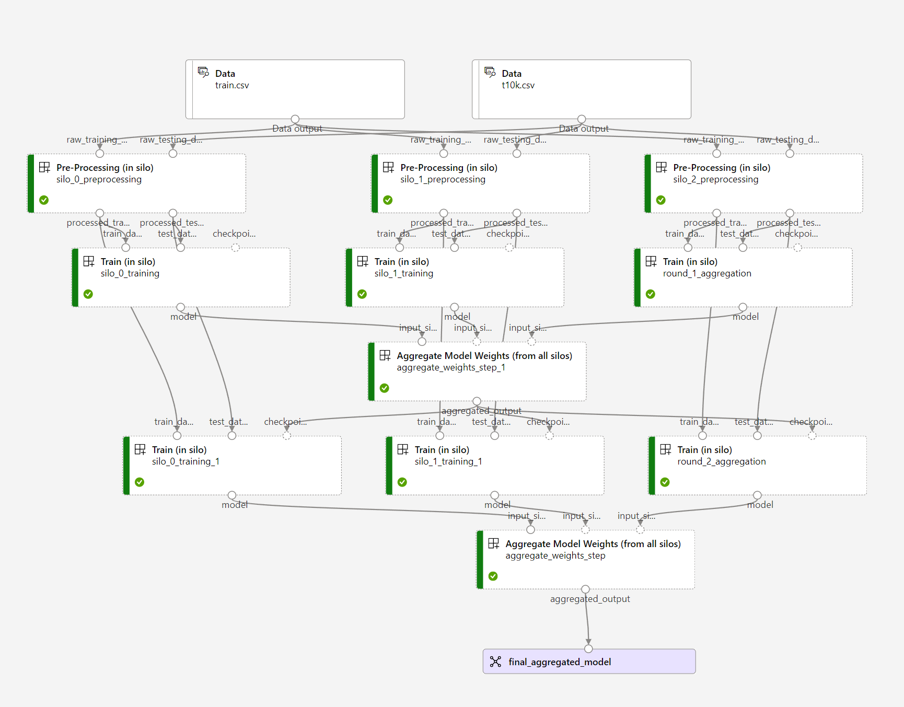
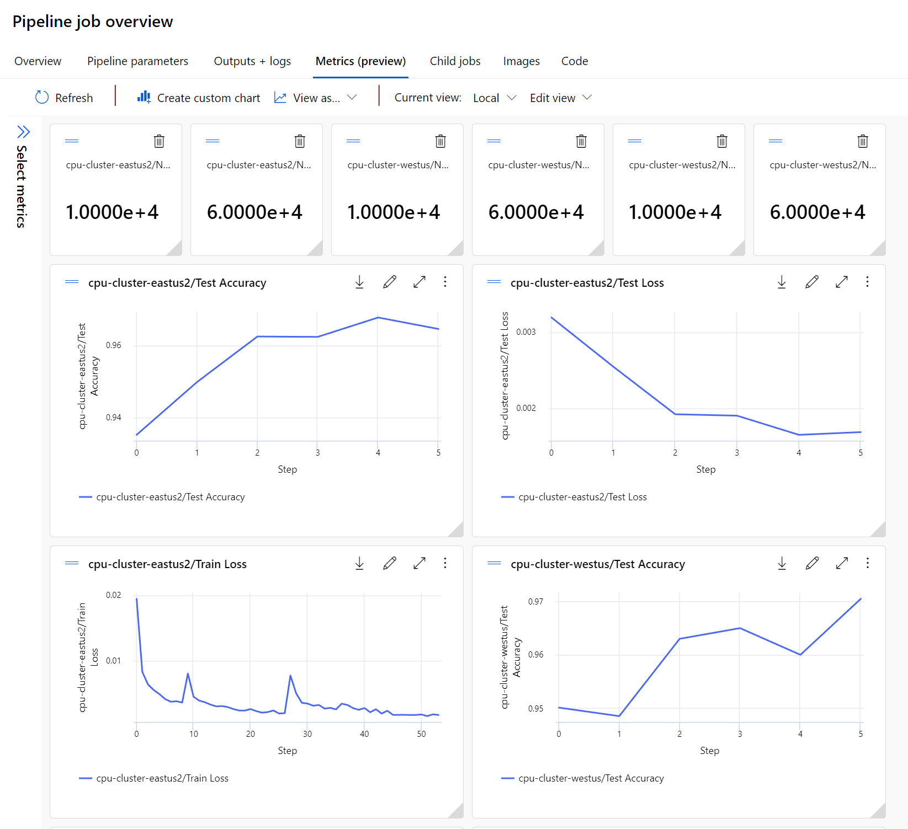
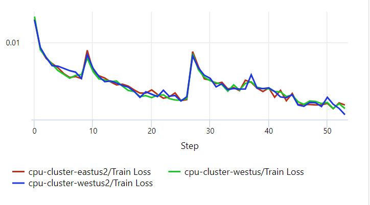

# Run a Federated Learning Demo in 5 mins

In this tutorial, you will:

* Provision a fully functional environment in your own Azure subscription
* Run a sample federated learning pipeline in Azure ML

## Prerequisites

To enjoy this quickstart, you will need to:

* have an active [Azure subscription](https://azure.microsoft.com) that you can use for development purposes,
* have permissions to create resources, set permissions, and create identities in this subscription (or at least in one resource group),
* [install the Azure CLI](https://learn.microsoft.com/en-us/cli/azure/install-azure-cli).

## Create a sandbox environment

Click on the buttons below depending on your goal. It will open in Azure Portal a page to deploy the resources in your subscription. You can find other available sandbox setups in our [sandboxes provisioning page](./provisioning/sandboxes.md).

This will provision a Federated Learning setup with 3 [_internal silos_](./concepts/glossary.md), _i.e._ silos that are in the same Azure tenant as the orchestrator. You will be to run the examples in the `./examples/pipelines` directory.

:rotating_light: :rotating_light: :rotating_light: **IMPORTANT: These sandboxes require you to be the _Owner_ of an Azure resource group.** _Contributor_ role is not enough. In your subscription, depending on admin policies, even if you can create a resource group yourself, you might not be the _Owner_ of it. Without ownership, you will not be able to set the RBAC roles necessary for provisioning these sandboxes. Ask your subscription administrator for help.

| Button | Description |
| :-- | :-- |
| [](https://portal.azure.com/#create/Microsoft.Template/uri/https%3A%2F%2Fraw.githubusercontent.com%2FAzure-Samples%2Fazure-ml-federated-learning%2Fmain%2Fmlops%2Farm%2Fsandbox_minimal.json) | [3-5 mins] A very minimal open sandbox to allow you to try things out. This setup works quick but only for this quickstart code and is intended for demo purposes. |
| [](https://portal.azure.com/#create/Microsoft.Template/uri/https%3A%2F%2Fraw.githubusercontent.com%2FAzure-Samples%2Fazure-ml-federated-learning%2Fmain%2Fmlops%2Farm%2Fsandbox_fl_eyesoff_cpu.json) | [5-7 mins] Deploy a full sandbox where the storages are kept eyes-off by a private service endpoint, accessible only by the silo compute through a vnet. This works with all our samples including both horizontal FL and vertical FL. |

> Notes:
>
> * :warning: To provision a sandbox you can also use for our real world examples, please provide your **kaggleUsername** and **kaggleKey** during the deployment, they will be stored in the workspace secret store.
> * If someone already provisioned a demo with the same name in your subscription, change **Demo Base Name** parameter to a unique value.
> * To deploy a sandbox manually using bicep, check our [configurable sandboxes tutorial](./provisioning/sandboxes.md#configurable-sandboxes).

## Launch the demo experiment

In this section, we'll use a sample python script to submit a federated learning experiment to Azure ML. The script will need to connect to your newly created Azure ML workspace first.

1. Create a conda environment with all the python dependencies, then activate it.

    ```bash
    conda env create --file ./examples/pipelines/environment.yml
    conda activate fl_experiment_conda_env
    ```

    Alternatively, you can install the dependencies directly:

    ```bash
    python -m pip install -r ./examples/pipelines/requirements.txt
    ```

2. To connect to your newly created Azure ML workspace, you'll need to provide the following info in the sample python script as CLI arguments.

    ```bash
    python ./examples/pipelines/fl_cross_silo_literal/submit.py --subscription_id <subscription_id> --resource_group <resource_group> --workspace_name <workspace_name> --example MNIST
    ```
    > Notes: 
        > * You can use --offline flag when running the job to just build and validate pipeline without submitting it.
        > * Differential privacy is disabled by default, but you can quickly turn it on by setting the `config.yaml` file's `dp` parameter to `true`.
    
    Note: you can also create a `config.json` file at the root of this repo to provide the above information. Follow the instructions on how to get this from the [Azure ML documentation](https://learn.microsoft.com/en-us/azure/machine-learning/how-to-configure-environment#workspace).

    ```json
    {
        "subscription_id": "<subscription-id>",
        "resource_group": "<resource-group>",
        "workspace_name": "<workspace-name>"
    }
    ```

    >Note: The `config.json` is in our `.gitignore` to avoid pushing it to git.

The script will submit the experiment to Azure ML. **It should open a direct link to the experiment** in the Azure ML UI.

If not, the script will print the URL to use in clear:

```log
Submitting the pipeline job to your AzureML workspace...
Uploading preprocessing (0.01 MBs): 100%|#######################################| 7282/7282 [00:00<00:00, 23820.31it/s]
Uploading traininsilo (0.01 MBs): 100%|#########################################| 9953/9953 [00:00<00:00, 32014.81it/s]
Uploading aggregatemodelweights (0.01 MBs): 100%|###############################| 5514/5514 [00:00<00:00, 14065.83it/s]

The url to see your live job running is returned by the sdk:
https://ml.azure.com/runs/.....
```

### Look at the pipeline in the AML UI

Go to the above URL and your pipeline would look similar to this:

<br/><br/>


If you want to look at the pipeline metrics, go to the "Job overview" (top-right corner) and then click on the "Metrics(preview)". The following screenshot shows what that would look like.

<br/><br/>


You can also create your own custom graph by clicking on the "Create custom chart" icon. Here is a sample custom chart showing the "Training Loss" of multiple silos in one graph.

<br/><br/>

