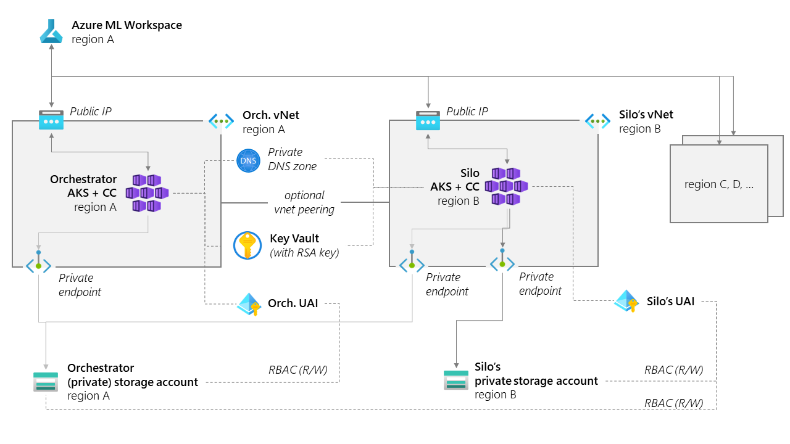

# Federated Learning with AzureML and Confidential Computes - an end-to-end tutorial

## Objectives
The goal of this tutorial is two-fold: introduce the resources in our [accelerator repository](https://github.com/Azure-Samples/azure-ml-federated-learning/tree/main), and guide you through your first implementation of Federated Learning on Confidential Compute.

## Scenario
The scenario we will be addressing is hand-written digit recognition, based on the classic MNIST dataset. We will train the model using Federated Learning.

The setup will be made of 1 orchestrator and 3 silos in the same Azure subscription/tenant (cross-tenant silos are possible, but harder to set up). All entities will be using Confidential Computes ([CVM's from dcasv5-series](https://learn.microsoft.com/en-us/azure/virtual-machines/dcasv5-dcadsv5-series)).

### Disclaimer
For the sake of time, we will NOT be uploading non-intersecting datasets to the 3 silos. We will just use the same [MNIST dataset](https://learn.microsoft.com/en-us/azure/open-datasets/dataset-mnist?tabs=azureml-opendatasets) (publicly available in Azure Open Datasets) in all 3 silos.

## Prerequisites
To enjoy this quickstart, you will need to:

* have an active [Azure subscription](https://azure.microsoft.com) that you can use for development purposes,
* have permissions to create resources, **set permissions**, and create identities in this subscription (or at least in one resource group),
  - :warning: **Please note that typically, the standard Contributor role in Azure does NOT allow you to set permissions**. You will need to be **Owner** of the resource group to be able to set permissions. Creating the resource group yourself will NOT automatically give you the Owner role. If you are not Owner, please ask your subscription Admin to grant you the Owner role on the resource group you will be using for this tutorial.
* [install the Azure CLI](https://learn.microsoft.com/en-us/cli/azure/install-azure-cli),
* install [kubectl](https://kubernetes.io/docs/tasks/tools/install-kubectl/),
* clone the [current repository](https://github.com/Azure-Samples/azure-ml-federated-learning).


## Provision the setup
To make sure you have all the resources you will need, it is strongly recommended to provision a [confidential sandbox](../provisioning/sandboxes.md#confidential-sandboxes). Just follow the instructions at the previous link, which are also copied below for convenience. Your first step will be to click the "Deploy to Azure" button, then you will need to provide the name of the resource group where you can adjust permissions. We also suggest you provide a custom Demo Base Name to avoid resource names conflicts. Keep that name short. 

>Deploy an eyes-off sandbox where the computes leverage confidential computing to keep your training and processing within an enclave.
>
>| Deploy | Description |
>| :-- | :-- |
>| [](https://portal.azure.com/#create/Microsoft.Template/uri/https%3A%2F%2Fraw.githubusercontent.com%2FAzure-Samples%2Fazure-ml-federated-learning%2Fmain%2Fmlops%2Farm%2Fsandbox_fl_confidential.json) | A sandbox with AKS clusters with confidential computes per silo and orchestrator. |
>
>Note: to take full benefit of the VMs, you will need to finalize the setup of the AKS cluster by [creating an instance type and use it in pipeline configs](../provisioning/silo_open_aks_with_cc.md#create-instancetype).
>
>### :exclamation: Important parameters
>
>| Parameter | Description | Values |
>| --- | --- | --- |
>| **computeSKU** | VM to provision in the AKS cluster (default will use [a CVM from dcasv5](https://learn.microsoft.com/en-us/azure/virtual-machines/dcasv5-dcadsv5-series)). You can also use any non-confidential SKU. | ex: `Standard_DC4as_v5` |
>| **siloRegions** | List of regions used for the silos. All our samples work with 3 regions. :exclamation: make sure you have quota in those regions for confidential compute in particular. | ex: `["australiaeast", "eastus", "westeurope"]` |
>| **orchestratorEyesOn** | Sets the orchestrator network access to either public (`true`) or private (`false`, default). |  `true` or `false` |
>| **applyVNetPeering** | Peer the silo networks to the orchestrator network to allow for live private communication between jobs (required for Vertical FL). | `true` or `false` |
>| **kaggleUsername** and **kaggleKey** | Optional: some of our samples require kaggle credentials to download datasets, this will ensure the credentials get injected in the workspace secret store properly (you can also [do that manually later](../tutorials/add-kaggle-credentials.md)). |
>
>### Architecture
>
>Note: in current sandbox, we're provisioning only in the `eastus` region by default, to allow for capacity and quick deployment.
>
>
>
>### Relevant Documentation
>
>To manually reproduce this full provisioning, see relevant documentation:
>
>- [Secure an Azure Machine Learning workspace with virtual networks](https://learn.microsoft.com/en-us/azure/machine-learning/how-to-secure-workspace-vnet)
>- [Introduction to Kubernetes compute target in Azure Machine Learning](https://learn.microsoft.com/en-us/azure/machine-learning/how-to-attach-kubernetes-anywhere)
>- [DCasv5 and DCadsv5-series confidential VMs](https://learn.microsoft.com/en-us/azure/virtual-machines/dcasv5-dcadsv5-series)
>- [Quickstart: Deploy an AKS cluster with confidential computing Intel SGX agent nodes by using the Azure CLI](https://learn.microsoft.com/en-us/azure/confidential-computing/confidential-enclave-nodes-aks-get-started)
>- [Network concepts for applications in Azure Kubernetes Service (AKS)](https://learn.microsoft.com/en-us/azure/aks/concepts-network)
>- [How to deploy Kubernetes extension](https://learn.microsoft.com/en-us/azure/machine-learning/how-to-deploy-kubernetes-extension?tabs=deploy-extension-with-cli)
>- [How to attach Kubernetes to Workspace](https://learn.microsoft.com/en-us/azure/machine-learning/how-to-attach-kubernetes-to-workspace?tabs=cli)
>- [Manage user-assigned managed identities](https://learn.microsoft.com/en-us/azure/active-directory/managed-identities-azure-resources/how-manage-user-assigned-managed-identities)


The sandbox provisioning should take about 15-20 minutes to complete. When that is done, you will need to follow [those instructions](../provisioning/silo_open_aks_with_cc.md#create-instancetype) (also copied below for convenience), which will guide you through the process of creating an InstanceType. If you don't understand the meaning of the last instruction in the linked page, do not worry. You can just skip it for now. The meaning should become clear in the next phase, and you can do that last part then.

>## Create InstanceType
>
>InstanceType sets restrictions for each job running on the AKS cluster. You can create multiple InstanceType(s) for different type of jobs. For example, job for pre-processing data is usually less demanding than a training job and thus the InstanceType can provide process with less resources. You can find example InstanceType definition in [`mlops/k8_templates/instance-type.yaml`](../../mlops/k8s_templates/instance-type.yaml). To create InstanceType follow these steps:
>
> >Note: Make sure you have `kubectl` tool installed: <https://kubernetes.io/docs/tasks/tools/>
>
>1. Update `mlops/k8_templates/instance-type.yaml` file to reflect minimum and limit resources for the job you intend to deploy (for simplicity you can just set the limit to resources provided by provisioned node in the AKS cluster)
>2. Update `name` property under `metadata` section in the `mlops/k8_templates/instance-type.yaml` file. Please remember this name as you will need it later on.
>3. Run `az login`
>4. Run `az account set --subscription <your-subscription-id>`
>5. Run `az aks get-credentials --resource-group <rg-name> --name <aks-name>`
>6. Navigate to `mlops/k8s_templates` folder and run: `kubectl apply -f instance-type.yaml`
>7. Add `instance_type` property to your pipeline config for the AKS silo and set value to the name set in the step 2

## Run the demo job
To run the demo job, the best way is to follow the instructions [here](../quickstart.md#launch-the-demo-experiment) in our quickstart document (also copied below for convenience). If you kept the default values when provisioning the setup, you should not have anything to change in the [yaml config file](../../examples/pipelines/fl_cross_silo_literal/config.yaml), besides adding the instance type (the last instruction that you might have skipped before).

>## Launch the demo experiment
>
>In this section, we'll use a sample python script to submit a federated learning experiment to Azure ML. The script will need to connect to your newly created Azure ML workspace first.
>
>1. Create a conda environment with all the python dependencies, then activate it.
>
>    ```bash
>    conda env create --file ./examples/pipelines/environment.yml
>    conda activate fl_experiment_conda_env
>    ```
>
>    Alternatively, you can install the dependencies directly:
>
>    ```bash
>    python -m pip install -r ./examples/pipelines/requirements.txt
>    ```
>
>2. To connect to your newly created Azure ML workspace, you'll need to provide the following info in the sample python script as CLI arguments.
>
>    ```bash
>    python ./examples/pipelines/fl_cross_silo_literal/submit.py --subscription_id <subscription_id> --resource_group <resource_group> --workspace_name <workspace_name> --example MNIST
>    ```
>    > Notes: 
>        > * You can use --offline flag when running the job to just build and validate pipeline without submitting it.
>        > * Differential privacy is disabled by default, but you can quickly turn it on by setting the `config.yaml` file's `dp` parameter to `true`.
>    
>    Note: you can also create a `config.json` file at the root of this repo to provide the above information. Follow the instructions on how to get this from the [Azure ML documentation](https://learn.microsoft.com/en-us/azure/machine-learning/how-to-configure-environment#workspace).
>
>    ```json
>    {
>        "subscription_id": "<subscription-id>",
>        "resource_group": "<resource-group>",
>        "workspace_name": "<workspace-name>"
>    }
>    ```
>
>    >Note: The `config.json` is in our `.gitignore` to avoid pushing it to git.
>
>The script will submit the experiment to Azure ML. **It should open a direct link to the experiment** in the Azure ML UI.
>
>If not, the script will print the URL to use in clear:
>
>```log
>Submitting the pipeline job to your AzureML workspace...
>Uploading preprocessing (0.01 MBs): 100%|#######################################| 7282/7282 [00:00<00:00, 23820.31it/s]
>Uploading traininsilo (0.01 MBs): 100%|#########################################| 9953/9953 [00:00<00:00, 32014.81it/s]
>Uploading aggregatemodelweights (0.01 MBs): 100%|###############################| 5514/5514 [00:00<00:00, 14065.83it/s]
>
>The url to see your live job running is returned by the sdk:
>https://ml.azure.com/runs/.....
>```


## Potential follow-ups

### Enable encryption at rest
To further protect your data, you can enable encryption at rest. This will encrypt the data in the silos storages. Our [credit card fraud detection example](../real-world-examples/ccfraud-horizontal.md) covers that. Please note that for this example, you will need a Kaggle account (since the data are downloaded from Kaggle).
