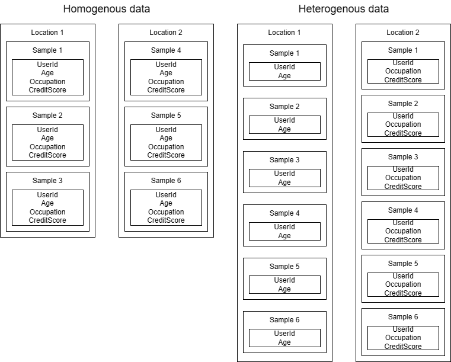
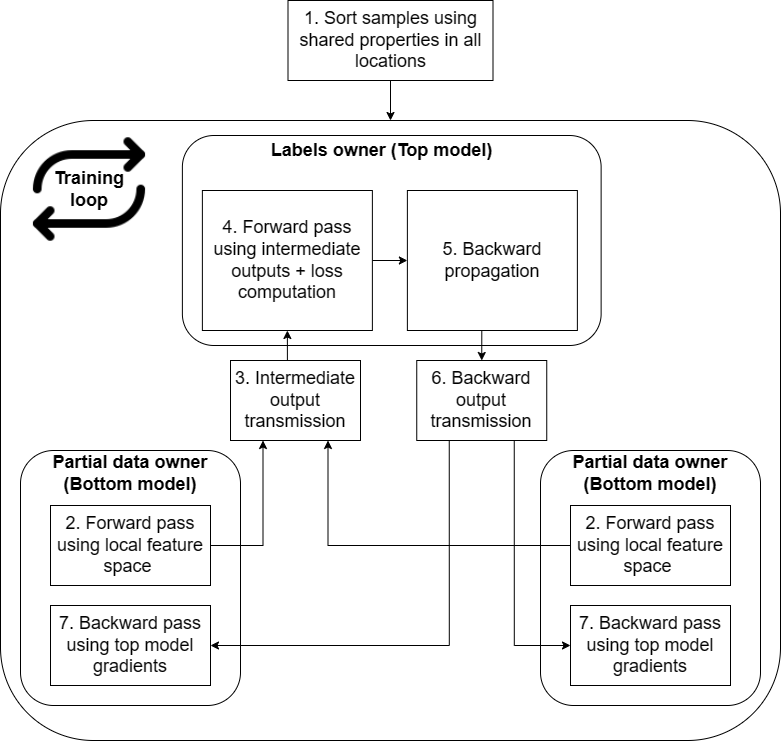

# Cross-silo vertical federated learning

## Background
Vertical federated learning (VFL) is branch of federated learning where the data are split across the features among the participants rather than across the samples (horizontal FL). In other words we can say that it takes federated learning to another level as it allows for cross-organization collaboration without need for having the same features while keeping privacy and security of each individual's data intact. Some of real-world examples include, but are not limited to:
- Finance: several institutions owning different pieces of data about their clients (e.g. bank account data, credit card data, loans data, ...etc)
- Healthcare: different healthcare facilities may own different modalities (e.g. x-ray scans, prescriptions, patient health records, ...etc)
- Retail: each retailer owns different information about customer and aggregating this information may result in better recommendations for the customer

<br/><br/>
<div align="center">
    
</div>

> Note: In this tutorial we refer to "host" as the party who owns the data labels and optionally some part of features and "contributors" as parties who own only features and provide host with intermediate outputs of their share of the network

## Objective and contents
This tutorial will guide you through steps required to set-up VFL experiments and point out important parts of the code. We target MNIST (written number recognition) and [CCFRAUD (financial tabular data)](../real-world-examples/ccfraud.md) examples in order to showcase versatility of the solution in regards to type of the data.  All of the examples here make use of mean aggregation and assumption is that the host owns only labels while features are equally distributed among the contributors.

## Infrastructure
First step towards successfully running VFL example is to provision an infrastructure. In order to do so, please navigate to [quickstart](../quickstart.md) and use **single-button deployment for vnet infrastructure deployment**. This is necessary in order for nodes to be able to communicate.

## Install the required dependencies

You'll need python to submit experiments to AzureML. You can install the required dependencies by running:

```bash
conda env create --file ./examples/pipelines/environment.yml
conda activate fl_experiment_conda_env
```

Alternatively, you can just install the required dependencies:

```bash
python -m pip install -r ./examples/pipelines/requirements.txt
```

## Data provisioning
The data format for VFL is different from regular FL. That is why each of our examples contains its own script for uploading data that are needed for a given example.

> Note: This will split the data such that each contributor owns its portion of the features and host own only the labels

### CCFRAUD

Please follow steps in [CCFRAUD - Add your Kaggle credentials to the workspace key vault](../real-world-examples/ccfraud.md#Add-your-Kaggle-credentials-to-the-workspace-key-vault). Afterwards, follow same steps as for **MNIST** and **please do not forget to replace `--example MNIST_VERTICAL` with `--example CCFRAUD_VERTICAL`**).

### MNIST

This can all be performed with ease using a data provisioning pipeline. To run it follow these steps:

1. If you are not using the quickstart setup, adjust the config file  `config.yaml` in `examples/pipelines/utils/upload_data/` to match your setup.

2. Submit the experiment by running:

   ```bash
   python ./examples/pipelines/utils/upload_data/submit.py --example MNIST_VERTICAL --workspace_name "<workspace-name>" --resource_group "<resource-group-name>" --subscription_id "<subscription-id>"
   ```

   > Note: You can use --offline flag when running the job to just build and validate pipeline without submitting it.

    :star: you can simplify this command by entering your workspace details in the file `config.yaml` in this same directory.

:warning: Proceed to the next step only once the pipeline completes. This pipeline will create data in 3 distinct locations.

## Model preparation for VFL
It is an ongoing research topic on how the model can be orchestrated in VFL. We have decided to go with the most common approach by splitting it between the host and contributors, also referred to as **split learning**, this approach can be easily altered by moving layers between parties to hosting whole model on contributors while host provides only aggregation and/or activation function. We believe that this can better demonstrate capabilities of VFL on AzureML and most of the existing models can be easily split without requiring too much work.

## Training

### Overview
Now, before we run the training itself let's take a step back and take a look on how such training works in VFL setup that is roughly depicted in the figure below. The first step that needs to take place ahead of the training is:

- **Private entity intersection and alignment** - before the training takes place we need to make sure that all of the parties involved share the same sample space and these samples are aligned during the training. **Our samples provide these guarantees by design but please make sure it's true for your custom data. This can be achieved by, for example, providing preprocessing step before training as we do not provide any for of PSI as of now.**

Afterwards, we can continue with regular training loop:
- **Forward pass in contributors** - all contributors, and optionally host, perform forward pass on their part of the model with features they own
- **Intermediate outputs transfer** - all outputs from previous step are sent to the host that performs an aggregation (for simplicity sake we make use of mean operation)
- **Loss computation** - host performs either forward pass on its part of network or just passes aggregated outputs of previous step through an activation function followed by loss computation
- **Gradients computation** - if host owns some part of the network, it performs backward pass, followed by computing gradients w.r.t inputs in all cases
- **Gradient transfer** - all contributors, and optionally host, receives gradients w.r.t. their intermediate outputs
- **Backward pass** - gradients are used to perform backward pass and update the network weights

<br/><br/>
<div align="center">
    
</div>

### Steps to launch
1. If you are not using the quickstart setup, adjust the config file  `config.yaml` in `examples/pipelines/<example-name>/` to match your setup.

2. Submit the experiment by running:

   ```bash
   python ./examples/pipelines/<example-name>/submit.py --config examples/pipelines/<example-name>/config.yaml --workspace_name "<workspace-name>" --resource_group "<resource-group-name>" --subscription_id "<subscription-id>"
   ```

   > Note: You can use --offline flag when running the job to just build and validate pipeline without submitting it.

    :star: you can simplify this command by entering your workspace details in the file `config.yaml` in this same directory.


## Tips and pitfalls
1. **Vertical Federated Learning comes at a cost**
    There is significant overhead when launching vertical federated learning due to heavy communication among participants. As we can see in the training loop there are two transfers per each mini-batch. One for forward pass outputs, one for gradients. This means that the training may take longer than expected.
2. **Intersection and entity alignment**
   The samples needs to be aligned across participants ahead of the training after we created set intersection of samples that are present on all involved parties. This process can reveal information to other entities that we may want to keep private. Fortunately there are **private set intersection** methods available out there that come to rescue.
3. **Communication encryption**
    Even though the intermediate outputs and gradients are not raw data, they still have been inferred using private data. Therefore, it's good to use encryption when communicating the data to parties outside of Azure.

## Additional resources
- [Private set intersection algorithm overview](https://xianmu.github.io/posts/2018-11-03-private-set-intersection-based-on-rsa-blind-signature.html)


